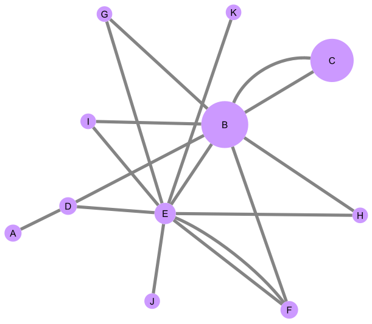

# Lab07 - Análise de Redes

## Tarefa de análises feitas no Cypher

## Exercício 1

Calcule o Pagerank do exemplo da Wikipedia em Cypher:

~~~cypher
LOAD CSV WITH HEADERS FROM 'https://raw.githubusercontent.com/santanche/lab2learn/master/network/pagerank/pagerank-wikipedia.csv' AS line
MERGE (p1:Page {name:line.source})
MERGE (p2:Page {name:line.target})
CREATE (p1)-[:LINKS]->(p2)

CALL gds.graph.create(
  'prGraph1',
  'Page',
  'LINKS'
)

CALL gds.pageRank.stream('prGraph1')
YIELD nodeId, score
RETURN gds.util.asNode(nodeId).name AS name, score
ORDER BY score DESC, name ASC
~~~
Resultado:
~~~
name	score
"B"	3.422628361545502
"C"	3.0444085506722334
"E"	0.7503553031226835
"D"	0.36260066517154566
"F"	0.36260066517154566
"A"	0.3041052853903018
"G"	0.15000000000000002
"H"	0.15000000000000002
"I"	0.15000000000000002
"J"	0.15000000000000002
"K"	0.15000000000000002
~~~

## Exercício 2

Departing from a Drug-Drug graph created in a previous lab, whose relationship determines drugs taken together, apply a community detection in it to see the results:

~~~cypher
(escreva aqui a resolução em Cypher)
~~~

> Coloque aqui a imagem resultante conforme o exemplo (não obrigatório, mas sugerido - imagem produzida pelo CytoScape ou Gephi).

